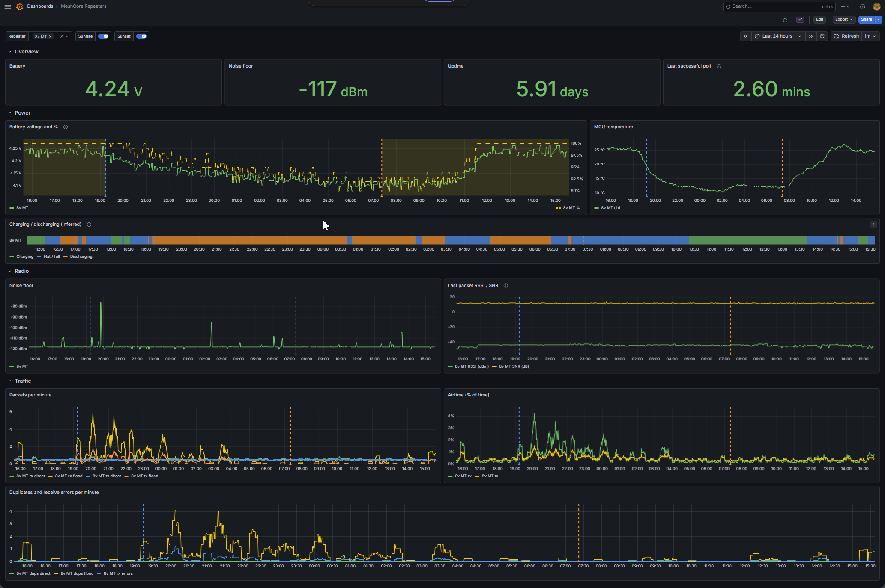
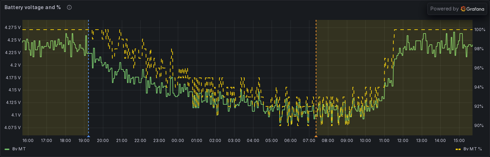
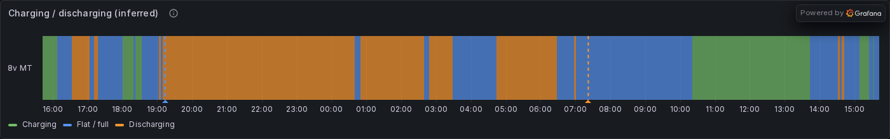

# meshcore-bot-repeater-telemetry

> **Note:** this is 100% vibecoded. It works great for me, but your mileage may
> vary. Proceed accordingly.

Graph your [MeshCore](https://github.com/meshcore-dev/MeshCore) repeaters in Grafana: battery, noise floor, signal, traffic and airtime. The repeaters are polled over the air by the companion radio your [meshcore-bot](https://github.com/agessaman/meshcore-bot) already runs.



## What's in here

| Path | What it is |
|---|---|
| `service_plugins/repeater_telemetry_service.py` | A meshcore-bot **local service plugin**. It logs in to your repeaters as a guest, requests status and telemetry, and serves the latest readings on a Prometheus `/metrics` endpoint. |
| `config.example.ini` | The plugin's config section, with every option explained. |
| `prometheus/scrape-config.example.yml` | The scrape job for Prometheus. |
| `dashboards/meshcore-repeaters.json` | The Grafana dashboard. |

## How it works

```
repeater  <-- zero-hop status/telemetry request --  meshcore-bot + companion radio
                                                        |
                                                   :9108/metrics
                                                        |
                                                   Prometheus  -->  Grafana
```

- **Why a plugin:** meshcore-bot holds the companion radio's serial port, so the poller has to run inside the bot. A separate exporter couldn't reach the radio.
- **Each poll** (every 4 minutes by default):
  - request **status** from each repeater;
  - if there's no answer, **log in as guest** and try once more. Guest sessions only live in the repeater's RAM, so this is needed after a repeater reboots;
  - request **telemetry**.
- **Zero hops only, never a flood.** Before each poll the plugin reads the repeater's contact from the radio and pins its path to zero-hop direct. The companion firmware floods requests to contacts with an unknown path, and those polls would go out across the whole mesh. If the contact is missing, or the path can't be pinned, the poll is **skipped**. So only poll repeaters your bot's radio hears directly.
- **Nothing is exported until the first successful poll,** so graphs never show a false zero.

## Requirements

- meshcore-bot with a companion radio on serial, BLE or TCP. The plugin uses the `meshcore` Python library and `aiohttp`, both already installed with meshcore-bot.
- One or more repeaters **heard directly** by that radio, that accept guest login. The default guest password is empty.
- Prometheus and Grafana. The dashboard was built on Grafana 12; the day/night formula needs PromQL trig functions, which arrived in Prometheus 2.31.

## Install

1. **Plugin.** Copy `service_plugins/repeater_telemetry_service.py` into `<local_dir_path>/service_plugins/`, creating the directory if needed. `local_dir_path` is set under `[Bot]` in meshcore-bot's config.
2. **Config.** Add the `[RepeaterTelemetry_Service]` section from `config.example.ini` to meshcore-bot's `config.ini`. Set `targets` to `Name:<64-hex public key>` for each repeater. Restart the bot. Its log should show `RepeaterTelemetry started` and, shortly after, one line per repeater per poll, e.g. `RepeaterTelemetry: My Repeater bat=4.223V noise=-118dBm …`.
3. **Prometheus.** Add the job from `prometheus/scrape-config.example.yml` with your bot host, reload Prometheus, and check that the target shows as up.
4. **Grafana.** Import `dashboards/meshcore-repeaters.json` (Dashboards → New → Import), or drop it into a file-provisioned dashboards directory.
   - It expects a Prometheus data source **named `Prometheus`**.
   - Then set your site's **latitude and longitude**: Dashboard settings → Variables → `lat` / `lon`, in decimal degrees. They drive the day/night shading, and the default is an example site (Greenwich).

## The dashboard



- **Battery voltage and %**
  - **The %** uses MeshCore's own on-device formula: a straight line from 3.0 V (0 %) to 4.2 V (100 %), rounded down and clamped. Repeaters only report voltage, so the dashboard converts it.
  - Above 4.2 V (e.g. while charging) the % holds at 100 while the voltage keeps moving.
  - The % axis scales to the data in view.
- **Day/night bands and sunrise/sunset markers**
  - Worked out in the PromQL query from the `lat`/`lon` variables, using NOAA's solar formulas: Spencer declination and equation of time, with the standard −0.833° horizon.
  - Because it's computed rather than recorded, **every past day is shaded**, whether or not the bot was running.
  - Checked against published sunrise/sunset tables: within about 3 minutes.



- **Charging / discharging (inferred)**
  - Repeaters don't report a charging flag, so this is **inferred from the battery voltage trend**: the slope over the last 2 hours.
  - **Charging** above +5 mV/h, **Discharging** below −5 mV/h, otherwise **Flat / full**. That last one includes a charger holding a full battery.
  - A 2-hour window is the shortest that follows the day/night cycle without flipping on single-sample ADC noise.
- **Other panels:** MCU temperature, noise floor, last-packet RSSI/SNR, packet rates, airtime %, duplicates and receive errors, uptime, and the time since the last successful poll.

## Metrics

Labels on every repeater metric: `repeater` (your name for it) and `pubkey` (the first 8 hex characters).

| Metric | Type | Notes |
|---|---|---|
| `meshcore_repeater_battery_volts` | gauge | from status |
| `meshcore_repeater_noise_floor_dbm` | gauge | |
| `meshcore_repeater_last_rssi_dbm` / `_last_snr_db` | gauge | the last packet the repeater heard |
| `meshcore_repeater_uptime_seconds` | gauge | |
| `meshcore_repeater_tx_queue_len` | gauge | |
| `meshcore_repeater_packets_received_total` / `_packets_sent_total` | counter | `route` = `flood` / `direct` |
| `meshcore_repeater_duplicates_total` | counter | `route` = `flood` / `direct` |
| `meshcore_repeater_receive_errors_total` | counter | omitted when the firmware doesn't report it |
| `meshcore_repeater_airtime_seconds_total` | counter | `dir` = `tx` / `rx` |
| `meshcore_repeater_full_events_total` | counter | |
| `meshcore_repeater_telemetry_voltage_volts` | gauge | from telemetry, per `channel` |
| `meshcore_repeater_temperature_celsius` | gauge | from telemetry (usually the MCU sensor), per `channel` |
| `meshcore_repeater_telemetry_value` | gauge | any other scalar telemetry, labelled by `type` and `channel` |
| `meshcore_repeater_poll_success` | gauge | 1/0, `kind` = `status` / `telemetry` |
| `meshcore_repeater_last_success_timestamp_seconds` | gauge | Unix time of the last successful poll |
| `meshcore_sun_daylight` / `meshcore_sun_elevation_degrees` | gauge | **optional**, only exported when `sun_latitude`/`sun_longitude` are set. The dashboard doesn't use them. |

Guests get **base** telemetry only: battery voltage and MCU temperature. External sensors on the repeater need an admin login, which this plugin doesn't do.

## Limitations

- **Charging state is an estimate.** It comes from the voltage trend, not from a charge controller.
- **No direct solar reading.** Some repeater boards, such as the Heltec MeshTower V2, have no solar or current sensor, so solar only shows up as the battery voltage rising in daylight.
- **Direct neighbours only.** Repeaters the bot's radio can't hear directly are skipped by design, rather than polled over the mesh.

## Credits

Built on [MeshCore](https://github.com/meshcore-dev/MeshCore), [meshcore-bot](https://github.com/agessaman/meshcore-bot) and the [meshcore](https://pypi.org/project/meshcore/) Python library.

## License

[GLWTPL](LICENSE) — the [Good Luck With That Public License](https://github.com/me-shaon/GLWTPL).
